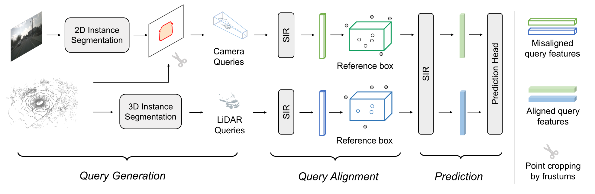

# Fully Sparse Fusion for 3D Object Detection 
## [](https://arxiv.org/abs/2304.12310)

### A multi-modal exploration on the paradigm of fully sparse 3D object detection

<div align="center">
  
</div><br/>

## Installation
First initialize the conda environment
```shell
conda create -n FSF python=3.8 -y
conda activate FSF
conda install pytorch==1.8.0 torchvision==0.9.0 torchaudio==0.8.0 cudatoolkit=11.1 -c pytorch -c conda-forge
```

Then, install the mmdet3d
```shell
#mmcv
pip install mmcv-full==1.3.9
#mmdet
pip install mmdet==2.14.0
#mmdet 3d
git clone https://github.com/open-mmlab/mmdetection3d.git
cd mmdetection3d
git checkout -v 0.17.1
pip install -v -e .
```


## Data Preparation
First, make the data dir
```shell
mkdir data
```
Then, please download the nuScenes and Argoverse 2 dataset and organize the data dir as follow:
```
├── data
|   ├── nuscenes
|   |   ├── samples
│   │   │   ├── CAM_BACK
│   │   │   ├── CAM_BACK_LEFT
│   │   │   ├── CAM_BACK_RIGHT
│   │   │   ├── CAM_FRONT
│   │   │   ├── CAM_FRONT_LEFT
│   │   │   ├── CAM_FRONT_RIGHT
│   │   │   ├── LIDAT_TOP
|   |   ├── sweeps
│   │   │   ├── CAM_BACK
│   │   │   ├── CAM_BACK_LEFT
│   │   │   ├── CAM_BACK_RIGHT
│   │   │   ├── CAM_FRONT
│   │   │   ├── CAM_FRONT_LEFT
│   │   │   ├── CAM_FRONT_RIGHT
│   │   │   ├── LIDAT_TOP
|   |   ├── v1.0-train
|   |   ├── v1.0-val
|   |   ├── v1.0-trainval
|   |   ├── nuscenes_infos_train.pkl
|   |   ├── nuscenes_infos_val.pkl
|   |   ├── nuscenes_infos_trainval.pkl
│   ├── argo2
│   │   │── argo2_format
│   │   │   │   │──sensor
│   │   │   │   │   │──train
│   │   │   │   │   │   │──...
│   │   │   │   │   │──val
│   │   │   │   │   │   │──...
│   │   │   │   │   │──test
│   │   │   │   │   │   │──0c6e62d7-bdfa-3061-8d3d-03b13aa21f68
│   │   │   │   │   │   │──0f0cdd79-bc6c-35cd-9d99-7ae2fc7e165c
│   │   │   │   │   │   │──...
│   │   │   │   │   │──val_anno.feather
│   │   │── kitti_format
│   │   │   │   │──argo2_infos_train.pkl
│   │   │   │   │──argo2_infos_val.pkl
│   │   │   │   │──argo2_infos_test.pkl
│   │   │   │   │──argo2_infos_trainval.pkl
│   │   │   │   │──training
│   │   │   │   │──testing
│   │   │   │   │──argo2_gt_database
```

For the argo2 pickles, you can either use the pickles we provided or generate them by yourself. If you want to generate them by yourself, please run the following commands:
```shell
python tools/AV2/argo2_pickle_mmdet_fusion.py
```

Please download the pretrained models and other files from [Google Drive](https://drive.google.com/drive/folders/1pylLxV6SEw2yf-ZZroKtCPAOKLg6nrUY?usp=drive_link).


Then, please organize the ckpt dir as follow:
```
├── ckpt
|   ├── fsd_argo_pretrain.pth
|   ├── fsd_nusc_pretrain.pth
|   ├── htc_x101_64x4d_fpn_dconv_c3-c5_coco-20e_16x1_20e_nuim_20201008_211222-0b16ac4b.pth
|   ├── htc_x101_64x4d_fpn_dconv_c3-c5_coco-20e_16x1_20e_nuim.py
```

Then use our scripts for pre-infering and saving 2D mask
```shell
./tools/mask_tools/save_mask_nusc.sh
./tools/mask_tools/save_mask_argo2.sh
```

## Train and Test
### nuScenes
After the preparation, you can train our model with 8 GPUs on nuScenes using:
```shell
./tools/nusc_train.sh nuScenes/FSF_nuScenes_config 8
```
For testing, please run the command:
```shell
./tools/dist_test.sh projects/configs/nuScenes/FSF_nuScenes_config.py $CKPT_PATH$ 8
```

### Argoverse 2
For training on Argoverse 2 with 8 GPUs, please using:
```shell
./tools/argo_train.sh Argoverse2/FSF_AV2_config 8
```
For testing, please run:
```shell
./tools/dist_test.sh projects/configs/Argoverse2/FSF_AV2_config.py $CKPT_PATH$ 8
```

## Results
| DATASET  | mAP  | NDS  | CDS |
|----------|------|------|-----|
| nuScenes | 70.8 | 73.2 |  -  |
| AV2      | 33.2 |  -   | 25.5|


## Citation
Please consider citing our work as follows if it is helpful.
```
@article{li2023fully,
  title={Fully sparse fusion for 3d object detection},
  author={Li, Yingyan and Fan, Lue and Liu, Yang and Huang, Zehao and Chen, Yuntao and Wang, Naiyan and Zhang, Zhaoxiang and Tan, Tieniu},
  journal={arXiv preprint arXiv:2304.12310},
  year={2023}
}
```

## Acknowledgement
This project is based on the following codebases. 

* [MMDetection3D](https://github.com/open-mmlab/mmdetection3d)
* [FSD](https://github.com/tusen-ai/SST) (Ours!)
